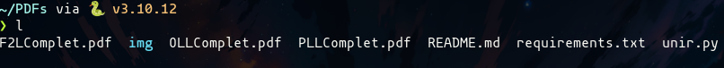
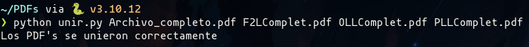
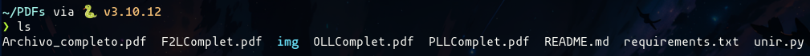

# PDF Merger

Este script de Python permite unir archivos de tipo PDF pasandole como parametros el nombre del nuevo PDF que se creará y los PDF's que se unirán

## Requisitos
- pypdf2

## Instalación

1. Clona el repositorio desde GitHub:
```bash
git clone https://github.com/brianrscode/pdf-merger.git
```
2. Instala las librerías necesarias desde la línea de comandos:
```bash
pip install -r requirements.txt
```

## Uso

1. Abre una terminal y navega al directorio donde se encuentra el archivo `unir.py`:

2. Ejecuta el script pasandole el nombre del nuevo PDF a crear y los nombres de los PDF a unir:
```bash
python unir.py <nombre_pdf_salida> <PDF1, PDF2, PDFn...>
```
3. Espera a que el script termine de ejecutarse. Una vez finalizado, si todo salió bien, se habrá creado un nuevo PDF con el nombre que diste en el primer parámetro y será la unión de los PDF que pasaste en el resto de parámetros

## Capturas de funcionamiento
Antes de unir los PDF's

Proceso de unión

Después de unirlos
